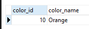

# 12. Managing Tables

### Data types

**(**_**cover the most commonly used PostgreSQL data types.**_**)**

#### Boolean

* 1, yes, y, t, true => true
* 0, no, false, f => false

#### Character

1. `CHAR(n)`
   * **fixed length** character with space padded. string shorter than length n will be padded by spaces, string longer than length will cause error
2. `VARCHAR(n)`
   * **variable length** character string. Postgres does not pad spaces when length is shorter than n
3. `TEXT`
   * variable length character string. Theoretically, text data is **character string with unlimited length**

#### Numberic

1. Integers
   1. Small integer (**`SMALLINT`**) is 2 byte signed integer
   2. Integer (**`INT`**) is 4 byte signed integer
   3. Serial is same as integer except that postgres will auto generate and populate values into **`SERIAL`** column. It is similar to **`AUTO_INCREMENT`** column in MySQL or **`AUTOINCREMENT`** in SqLite
2. Floating point numbers
   1. `float(n)` is floating point number precious at least n upto max 8 bytes
   2. `real` or `float8` is 4 byte floating point number
   3. `numeric` or `numeric(p,s)` is real number with p digits with s number after decimal point

#### Temporal data types

1. `DATE` stores the dates only
2. `TIME` stores the time of day values
3. `TIMESTAMP` stores both date and time values
4. `TIMESTAMPZ` is timezone aware timestamp data type. It is postgres extension to sql standard temporal data types
5. `INTERVAL` stores periods of time

#### Arrays

In Postgres, we can store array of strings, array of integers, etc, in array columns. It comes handy in some situations like storing days of week, months of year, etc

#### JSON

Posgres provides two JSON data types

1. `JSON` stores plain JSON data that require reparsing for each processing
2. `JSONB` stores JSON data in binary format which is faster to process but slower to insert. It also supports indexing which can be advantegeous

#### UUID

It allows us to store Universal Unique Identifiers. The `UUID` values guarentee a better uniqueness than `SERIAL` and can be used to hide sensitive data exposed to public such as values of `id` in URL

#### Special data types

Postgres provides several special data types related to geometric and netowrk

1. `box` a rectangular box
2. `line` a set of points
3. `point` a geometric pair of numbers
4. `lseg` a line segment
5. `polygon` a closed geometric
6. `inet` an IPv4 address
7. `macaddr` a MAC address


### Create a table

**(**_**guide you on how to create a new table in the database.**_**)**

* We can use the `CREATE TABLE` statement whose syntax is

```sql
CREATE TABLE [IF NOT EXISTS] table_name (
	column1 datatype(length) column_constraint,
	column2 datatype(length) column_conttraint,
	...,
	table_constraints
);
```

#### Constraints

1. `NOT NULL` ensures values can not be NULL
2. `UNIQUE` ensures values in a column are unique across rows
3. `PRIMARY KEY` uniquely identifies rows in a table, a table can have one and only one primary key
4. `CHECK` ensures that data must satisfy a boolean expression
5. `FOREIGN KEY` ensures values in a column or a group of columns from a table exists in a column or group of columns in another table. A table can have many foreign keys

#### Example

Accounts table

```sql
CREATE TABLE accounts (
	user_id serial PRIMARY KEY,
	username VARCHAR ( 50 ) UNIQUE NOT NULL,
	password VARCHAR ( 50 ) NOT NULL,
	email VARCHAR ( 255 ) UNIQUE NOT NULL,
	created_on TIMESTAMP NOT NULL,
        last_login TIMESTAMP
);
```

Roles table

```sql
CREATE TABLE roles(
   role_id serial PRIMARY KEY,
   role_name VARCHAR (255) UNIQUE NOT NULL
);
```

Account Roles table

```sql
CREATE TABLE account_roles (
	user_id INT NOT NULL,
	role_id INT NOT NULL,
	grant_date TIMESTAMP,
	PRIMARY KEY (user_id, role_id),
	FOREIGN KEY (role_id)
		REFERENCES roles (role_id),
	FOREIGN KEY (user_id)
		REFERENCES accounts (user_id)
);
```

<figure><figcaption></figcaption></figure>

### Select Into & Create table as

**(**_**shows you how to create a new table from the result set of a query.**_**)**

* PostgreSQL `SELECT INTO` statement creates a new table and inserts data returned from a query into the table.
* Its syntax is

```sql
SELECT
	select_list
INTO [ TEMPORARY | TEMP | UNLOGGED ] [ TABLE ] new_table_name
FROM
	table_now
WHERE
	search_condition;
```

* The TEMP or TEMPORARY keyword is optional; it allows you to create a temporary table instead.
* The UNLOGGED keyword if available will make the new table as an unlogged table.
* Besides the WHERE clause, you can use other clauses in the SELECT statement for the SELECT INTO statement such as INNER JOIN, LEFT JOIN, GROUP BY, and HAVING.
* Note that **you cannot use the `SELECT INTO` statement in PL/pgSQL** because it interprets the INTO clause differently. In this case, you can use the `CREATE TABLE AS` statement which provides more functionality than the SELECT INTO statement. Its syntax is

```sql
CREATE TABLE new_table_name
AS query;
```

#### Example

Suppose we have a film table

<figure><figcaption></figcaption></figure>

Create a new table `film_r` that contains film with R rating and rental duration 5 days from `film` table

```sql
SELECT
	film_id,
	title,
	rental_date
INTO TABLE film_r
FROM
	film
WHERE
	rating = 'R'
AND rental_duration = 5
ORDER BY
	title;
```

<figure><figcaption></figcaption></figure>

### Auto-increment column with SERIAL

**(**_**uses SERIAL to add an auto-increment column to a table.**_**)**

```sql
CREATE TABLE table_name(
    id SERIAL
);
```

* By assigning the `SERIAL` pseudo-type to the `id` column, PostgreSQL performs the following:
  1. First, create a sequence object and set the next value generated by the sequence as the default value for the column.
  2. Second, add a NOT NULL constraint to the id column because a sequence always generates an integer, which is a non-null value.
  3. Third, assign the owner of the sequence to the id column; as a result, the sequence object is deleted when the id column or table is dropped


### Sequences

**(**_**introduce you to sequences and describe how to use a sequence to generate a sequence of numbers.**_**)**

* A sequence in PostgreSQL is a user-defined schema-bound object that generates a sequence of integers based on a specified specification.
* We can use `CREATE SEQUENCE` statement
* Its syntax is

```sql
CREATE SEQUENCE [ IF NOT EXISTS ] sequence_name
    [ AS { SMALLINT | INT | BIGINT } ]
    [ INCREMENT [ BY ] increment ]
    [ MINVALUE minvalue | NO MINVALUE ]
    [ MAXVALUE maxvalue | NO MAXVALUE ]
    [ START [ WITH ] start ]
    [ CACHE cache ]
    [ [ NO ] CYCLE ]
    [ OWNED BY { table_name.column_name | NONE } ]
```


### Identity column

**(**_**show you how to use the identity column.**_**)**

* PostgreSQL version 10 introduced a new constraint GENERATED AS IDENTITY that allows you to automatically assign a unique number to a column.
* Its syntax is

```sql
column_name type GENERATED { ALWAYS | BY DEFAULT } AS IDENTITY[ ( sequence_option ) ]
```

* The type can be SMALLINT, INT, or BIGINT.
* The `GENERATED ALWAYS` instructs PostgreSQL to always generate a value for the identity column. If you attempt to insert (or update) values into the GENERATED ALWAYS AS IDENTITY column, PostgreSQL will issue an error.
* The `GENERATED BY DEFAULT` also instructs PostgreSQL to generate a value for the identity column. However, if you supply a value for insert or update, PostgreSQL will use that value to insert into the identity column instead of using the system-generated value.
* PostgreSQL allows you a table to have more than one identity column. Like the SERIAL, the GENERATED AS IDENTITY constraint also uses the `SEQUENCE` object internally.
* You can add identity columns to an existing table by using the following form of the `ALTER TABLE` statement

#### Example

```sql
CREATE TABLE color (
    color_id INT GENERATED BY DEFAULT AS IDENTITY
    (START WITH 10 INCREMENT BY 10),
    color_name VARCHAR NOT NULL
);
```

```sql
INSERT INTO color (color_name)
VALUES ('Orange');
```

<figure><figcaption></figcaption></figure>

```sql
INSERT INTO color (color_name)
VALUES ('Purple');
```

<figure><figcaption></figcaption></figure>

### Alter table

**(**_**modify the structure of an existing table.**_**)**

```sql
ALTER TABLE table_name action;
```


### Rename table

**(**_**change the name of the table to a new one.**_**)**

```sql
ALTER TABLE table_name
RENAME TO new_table_name;
```

